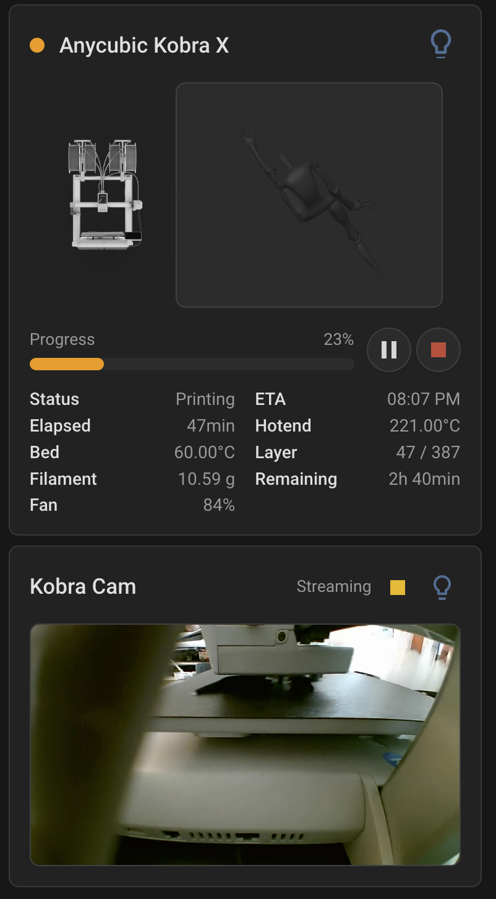

# Anycubic Kobra X LAN Mode Home Assistant integration

Custom Home Assistant integration for Anycubic FDM printers that expose the
local Anycubic MQTT API used by the Kobra X.

Setup only needs the printer's LAN IP address. The printer must be online, on
the same network as Home Assistant, and have LAN mode enabled.

## Preview



## Install

### HACS

Add this repository to HACS as a custom repository:

```text
https://github.com/stribor/anycubic_kobrax
```

Choose category **Integration**, install **Anycubic Kobra X LAN Mode**, restart Home
Assistant, then add the integration from Settings > Devices & services.

### Manual

Copy `custom_components/anycubic_kobrax` into the `custom_components` directory
of your Home Assistant configuration, restart Home Assistant, then add the
integration from Settings > Devices & services.

## Configuration

Add the integration from Settings > Devices & services and enter the printer
host or IP address:

```yaml
host: 192.168.1.100
```

During setup the integration reads `http://<printer>:18910/info`, signs the
printer's LAN control request, decrypts the returned MQTT bundle, and stores the
local MQTT username, password, client certificate, client key, model ID, printer
ID, and discovered printer metadata in the Home Assistant config entry. The
printer name is prefilled from `deviceName` and can be edited during setup or
later from the integration options.

The camera stream path is optional. If the integration sees a MQTT video
response containing a `/live/<token>` path, it will use that. If token discovery
does not work, set the path manually in options, for example:

```text
/live/k5DawnaQ
```

## Security

The integration stores the LAN MQTT credentials and client certificate material
returned by the printer in the Home Assistant config entry. Avoid sharing config
entries, debug captures, or logs without checking them for printer IDs, host
addresses, stream tokens, MQTT credentials, client certificates, and client
keys.

## License

This project is licensed under the MIT License. See [LICENSE](LICENSE).

## Implemented

- MQTT connection to the printer on port `9883`
- TLS with certificate validation disabled for the printer's self-signed cert
- IP-only setup that discovers LAN MQTT credentials from port `18910`
- Periodic `status`, `info`, `tempature`, `fan`, `peripherie`, and `light`
  queries, plus `lastWill`, `multiColorBox`, and slicer `info`
- Sensors for print state, progress, filename, nozzle temperature, bed
  temperature, target temperatures, fan speeds, material, layer, and timing
- Diagnostic MQTT sensor exposing the last received topic and payload attributes
- Brightness-capable light entity using Anycubic's `0-100` brightness scale
- Camera entity that sends `startCapture`/`stopCapture` and exposes the FLV URL
  to Home Assistant's stream/ffmpeg pipeline
- Lovelace camera card with start/stop stream control and a synced printer light
  toggle
- Local Home Assistant brand icon at
  `custom_components/anycubic_kobrax/brand/icon.png`

## Dashboard card

The main `anycubic-kobrax-card` auto-discovers the integration entities, but it
can be made shorter with optional card settings:

```yaml
type: custom:anycubic-kobrax-card
name: Kobra X
progress_style: bar # number, bar, or hidden
hide_progress_when_idle: true # default; set false to keep 100% visible when idle
hide_preview_when_idle: true
stats_columns: 2
visible_stats:
  - status
  - eta
  - elapsed
  - hotend
  - bed
  - fan
  - remaining
show_slots: true
show_print_controls: true # set false to hide pause/resume and stop controls
show_pause_button: true # optional; set false to hide only pause/resume
show_stop_button: true # optional; set false to hide only stop
media_view: preview # preview, thumbnail, camera, or none
camera_entity: camera.kobra_x_camera # optional when media_view is camera
```

For a small image-focused card, use compact layout. It hides the detailed stats
and filament slots, keeps the printer/preview image, and shows either progress
with remaining time or the idle/free status:

```yaml
type: custom:anycubic-kobrax-card
name: Kobra X
layout: compact
progress_style: bar
hide_preview_when_idle: true
show_header: false
```

## Notifications and automations

The integration does not send notifications by itself. Instead it exposes print
lifecycle events so each Home Assistant user can choose their own notification
target, such as the mobile app, persistent notifications, a speaker, or a light.

The printer event entity emits these event types:

- `print_started`
- `print_preheating`
- `print_printing`
- `print_completed`
- `print_paused`
- `print_stopped`
- `print_failed`
- `axis_error`

To notify a phone when a print finishes, create an automation similar to this
and replace `event.kobra_x_printer_event` and `notify.mobile_app_your_phone`
with your entity and notification target:

```yaml
alias: Anycubic print finished
triggers:
  - trigger: state
    entity_id: event.kobra_x_printer_event
    attribute: event_type
    to: print_completed
actions:
  - action: notify.mobile_app_your_phone
    data:
      title: Print finished
      message: >-
        {{ state_attr('event.kobra_x_printer_event', 'filename')
           or 'Your Anycubic print is done.' }}
```

For a failed print notification:

```yaml
alias: Anycubic print failed
triggers:
  - trigger: state
    entity_id: event.kobra_x_printer_event
    attribute: event_type
    to: print_failed
actions:
  - action: notify.mobile_app_your_phone
    data:
      title: Print failed
      message: >-
        {{ state_attr('event.kobra_x_printer_event', 'message')
           or state_attr('event.kobra_x_printer_event', 'filename')
           or 'The printer reported a failure.' }}
```

The same events are also available as device triggers in the automation UI. When
creating an automation, choose the Anycubic printer as the device, then select a
trigger such as **Print completed**, **Print failed**, or **Axis error**. Device
triggers are a UI-friendly wrapper around the integration's printer events; they
do not send notifications on their own.

## Capturing MQTT samples

This optional contributor/debug workflow captures real printer traffic to help
improve decoder coverage. Keep captures and local credentials in `.local/`,
which is ignored by git, because they may contain printer identifiers, stream
tokens, credentials, and file names:

```bash
python3 -m venv .venv
source .venv/bin/activate
python -m pip install --upgrade pip
python -m pip install -r requirements.txt
```

```bash
python3 scripts/capture_mqtt.py \
  --host 192.168.1.100 \
  --keep-images \
  --request-file-details \
  --output .local/mqtt-capture.jsonl
```

With only `--host`, the script uses the same LAN credential discovery flow as
the integration. It accepts command-line overrides for `--config`, `--username`,
`--password`, `--cert`, `--key`, `--topic`, `--count`, and `--duration`. It
writes one JSON object per MQTT message and redacts sensitive-looking fields and
large embedded images by default. Use `--keep-images` to keep `png_image`,
`svg_image`, and `thumbnail` file preview fields while still redacting
credentials and tokens. Use `--request-file-details` to actively request the
file metadata response that contains those images after the capture sees a print
filename. Use `--no-discover` to require explicit MQTT credentials from the
config file or command line.

Extract captured file preview images with:

```bash
python3 scripts/extract_mqtt_images.py .local/mqtt-capture.jsonl
```

## Still to improve

- SSDP/mDNS discovery for `uuid:fdm:...`
- More complete decoding once real MQTT payload samples are available
